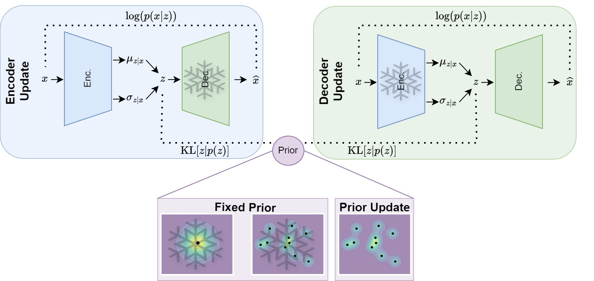

# Prior Learning in Introspective VAEs [TMLR 2025]

**Authors**: [Ioannis Athanasiadis](https://scholar.google.com/citations?user=RCAtJgUAAAAJ), [Fredrik Lindsten](https://scholar.google.com/citations?user=GylfPngAAAAJ), [Michael Felsberg](https://scholar.google.com/citations?user=kWfR08AAAAJ)


## Abstract

Variational Autoencoders (VAEs) are a popular framework for unsupervised learning and data generation. A plethora of methods have been proposed focusing on improving VAEs, with the incorporation of adversarial objectives and the integration of prior learning mechanisms being prominent directions. When it comes to the former, an indicative instance is the recently introduced family of Introspective VAEs aiming at ensuring that a low likelihood is assigned to unrealistic samples. In this study, we focus on the Soft-IntroVAE (S-IntroVAE), one of only two members of the Introspective VAE family, the other being the original IntroVAE. We select S-IntroVAE for its state-of-the-art status and its training stability. In particular, we investigate the implication of incorporating a multimodal and trainable prior into this S IntroVAE. Namely, we formulate the prior as a third player and show that when trained in cooperation with the decoder constitutes an effective way for prior learning, which shares the Nash Equilibrium with the vanilla S-IntroVAE. Furthermore, based on a modified formulation of the optimal ELBO in S-IntroVAE, we develop theoretically motivated regularizations, namely (i) adaptive variance clipping to stabilize training when learning the prior and (ii) responsibility regularization to discourage the formation of inactive prior mode. Finally, we perform a series of targeted experiments on a 2D density estimation benchmark and in an image generation setting comprised of the (F)-MNIST and CIFAR-10 datasets demonstrating the benefit of prior learning in S-IntroVAE in generation and representation learning.

<figure>
  
</figure>

**TL;DR:** Developing the regularizations needed to learn the prior in Introspective VAEs.

[📄 View Paper on OpenReview](https://openreview.net/forum?id=u4YDVFodYX)

## Repository Structure

The experiments are organized into the following directories:

- `2D/` – Experiments on synthetic 2D density estimation benchmarks.
- `image/` – Experiments on real image datasets, including (F)-MNIST and CIFAR-10.

## Installation

To set up the Conda environment required to run the experiments:

```bash
conda env create -f environment.yml
conda activate introspective-vae
```


## Credits
This implementation builds upon these works:

* Soft-IntroVAE: Analyzing and Improving Introspective Variational Autoencoders, Daniel et al., CVPR 2021 - [Code](https://github.com/taldatech/soft-intro-vae-pytorch), [Paper](https://arxiv.org/abs/2012.13253)
* VAE with a VampPrior, Tomczak et al., AISTATS 2018  - [Code](https://github.com/jmtomczak/vae_vampprior), [Paper](https://arxiv.org/abs/1705.07120).
